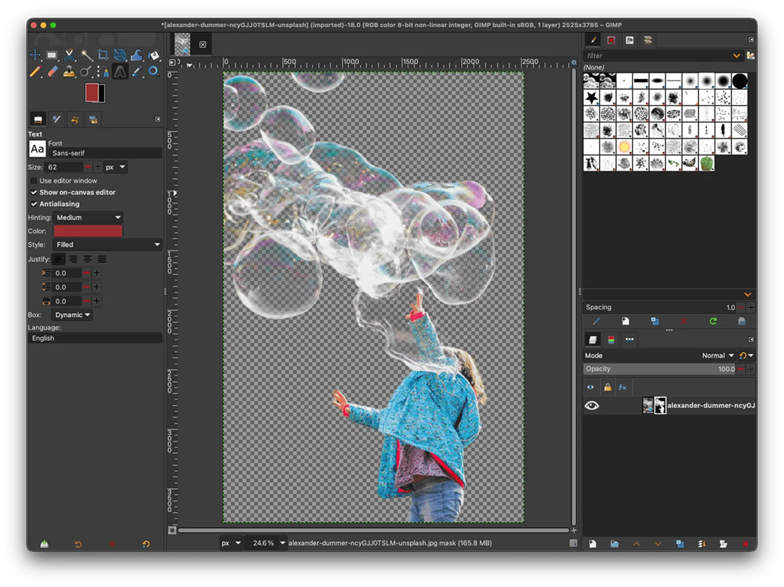
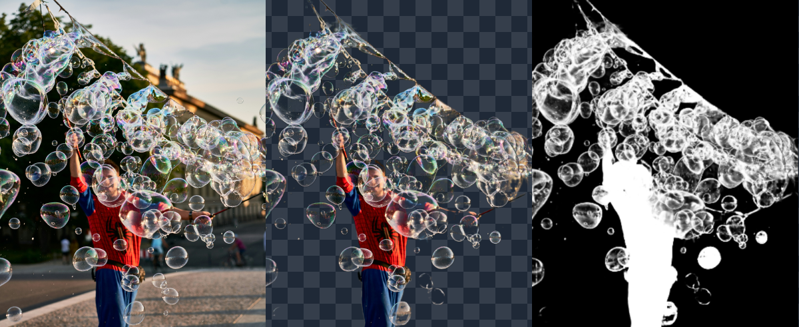

# WithoutBG — GIMP Plugin



**Remove backgrounds in GIMP 3. Private and on-device — nothing leaves your machine.**

A GIMP 3.x plugin that talks to your local WithoutBG server (Mac Local API or Docker). The plugin adds an unapplied layer mask so you can review and refine before committing.

**[Plugin page →](https://withoutbg.com/open-model/plugins/gimp?utm_source=github&utm_medium=withoutbg-gimp-readme&utm_campaign=main-readme)** · **[Local API docs →](https://withoutbg.com/docs/open-model/local-api?utm_source=github&utm_medium=withoutbg-gimp-readme&utm_campaign=main-readme)**

## See the results




**[Open Weights results →](https://withoutbg.com/open-model/results?utm_source=github&utm_medium=withoutbg-gimp-readme&utm_campaign=main-readme)** · **[Cloud API results →](https://withoutbg.com/pro-model/results?utm_source=github&utm_medium=withoutbg-gimp-readme&utm_campaign=main-readme)** · **[Compare →](https://withoutbg.com/compare/withoutbg-open-model-vs-pro-model?utm_source=github&utm_medium=withoutbg-gimp-readme&utm_campaign=main-readme)**

## Requirements

| Dependency | Notes |
|---|---|
| GIMP 3.x | Available at [gimp.org](https://www.gimp.org) |
| WithoutBG server | Must be running at `http://127.0.0.1:8000` — [Docker](https://withoutbg.com/docs/open-model/docker?utm_source=github&utm_medium=withoutbg-gimp-readme&utm_campaign=main-readme) `service-cpu` / `service-gpu`, or the [Mac app](https://withoutbg.com/mac?utm_source=github&utm_medium=withoutbg-gimp-readme&utm_campaign=main-readme) Local API (or change `SERVER_URL` in `withoutbg/withoutbg.py`). See [Local API docs](https://withoutbg.com/docs/open-model/local-api?utm_source=github&utm_medium=withoutbg-gimp-readme&utm_campaign=main-readme). |

### Start a server

**Docker (CPU or GPU, any platform):**

```bash
docker run --rm -p 8000:8000 withoutbg/withoutbg-openweights-v3-service-cpu:latest
```

More options: [Docker docs](https://withoutbg.com/docs/open-model/docker?utm_source=github&utm_medium=withoutbg-gimp-readme&utm_campaign=main-readme).

**Mac app:** [download](https://withoutbg.com/mac?utm_source=github&utm_medium=withoutbg-gimp-readme&utm_campaign=main-readme), then start the Local API from the menu bar (defaults to port 8000). For CI/automation, see [Mac headless](https://withoutbg.com/mac/headless?utm_source=github&utm_medium=withoutbg-gimp-readme&utm_campaign=main-readme).

Run one backend at a time on port 8000.

## Install

```bash
bash -c "$(curl -fsSL https://raw.githubusercontent.com/withoutbg/withoutbg-gimp/main/install.sh)"
```

Or, if you already have the repo:

```bash
./install.sh
```

Then restart GIMP. The plugin appears under:

```
Tools ▸ WithoutBG ▸ Remove Background…
```

## Usage

1. Open any image in GIMP.
2. Go to **Tools ▸ WithoutBG ▸ Remove Background…**
3. The dialog shows the server status and lets you override the server URL.
4. Click **Remove Background**.

The plugin adds an unapplied layer mask from the server’s alpha matte. Review it, then use **Layer ▸ Mask ▸ Apply Layer Mask** to commit.

## Configuration

The default server URL (`http://127.0.0.1:8000`) is hardcoded at the top of
`withoutbg/withoutbg.py`. You can also change it per-session inside the
interactive dialog — GIMP remembers the last-used value between runs.

## Uninstall

```bash
rm -rf ~/Library/Application\ Support/GIMP/3.*/plug-ins/withoutbg   # macOS
# or
rm -rf ~/.config/GIMP/3.*/plug-ins/withoutbg                        # Linux
```

## More than GIMP

This plugin is the **GIMP 3** path: mask-first cutouts via a local server. Same open-weights technology powers the rest of the ecosystem:

| Surface | Choose when |
|---|---|
| **[Mac app](https://withoutbg.com/mac?utm_source=github&utm_medium=withoutbg-gimp-readme&utm_campaign=main-readme)** | You want a native desktop cutout tool, with an optional Local API for this plugin |
| **[Docker / self-host](https://github.com/withoutbg/withoutbg-inference)** | You want an HTTP API or browser UI on your own server (CPU or NVIDIA GPU) |
| **[Python package](https://github.com/withoutbg/withoutbg-python)** | You want to embed withoutBG in scripts, notebooks, or backends |
| **[Hugging Face](https://huggingface.co/withoutbg/withoutbg-openweights-onnx)** · **[Space](https://huggingface.co/spaces/withoutbg/withoutbg)** | You want to try a demo or download the ONNX weights directly |
| **[Cloud API](https://withoutbg.com/pro-model?utm_source=github&utm_medium=withoutbg-gimp-readme&utm_campaign=main-readme)** | You need maximum quality without running inference yourself |

## Model

The withoutBG Open Weights Model is a unified ONNX / Core ML graph. Depth, segmentation, matting, and refinement run in one pass. Built with DINOv3.

Licensed under the [withoutBG Open Model License](https://withoutbg.com/open-model/license?utm_source=github&utm_medium=withoutbg-gimp-readme&utm_campaign=main-readme) (Apache 2.0 for withoutBG portions; Meta DINOv3 License for DINOv3 backbone weights).

## Support

- **Bugs / questions:** [GitHub Issues](https://github.com/withoutbg/withoutbg-gimp/issues)
- **Plugin page:** [withoutbg.com/open-model/plugins/gimp](https://withoutbg.com/open-model/plugins/gimp?utm_source=github&utm_medium=withoutbg-gimp-readme&utm_campaign=main-readme)
- **Commercial:** [contact@withoutbg.com](mailto:contact@withoutbg.com)
